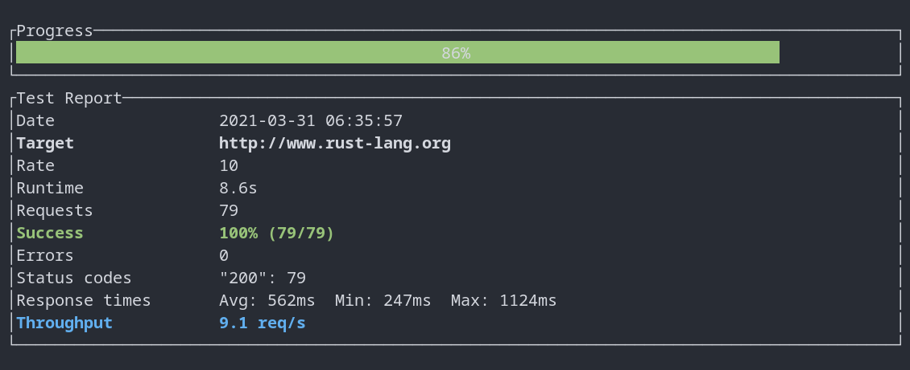

# paine
Yet another simple HTTP load testing tool written in [Rust](https://www.rust-lang.org).

## build
```
$ git clone https://github.com/jasilven/paine.git
Cloning into 'paine'...
.
.
$ cargo install --path paine/
```

## run
```
$ paine --help
paine
Simple http load testing tool

USAGE:
    paine [OPTIONS] --url <url>

FLAGS:
    -h, --help       Prints help information
    -V, --version    Prints version information

OPTIONS:
    -d, --duration <duration>            test duration in seconds [default: 60]
    -r, --rate <rate>                    requests per seconds [default: 10]
    -t, --timeout-secs <timeout-secs>    http timeout in seconds [default: 10]
    -u, --url <url>                      target url

$ paine -d 10 -r 10 -u http://www.rust-lang.org
```

